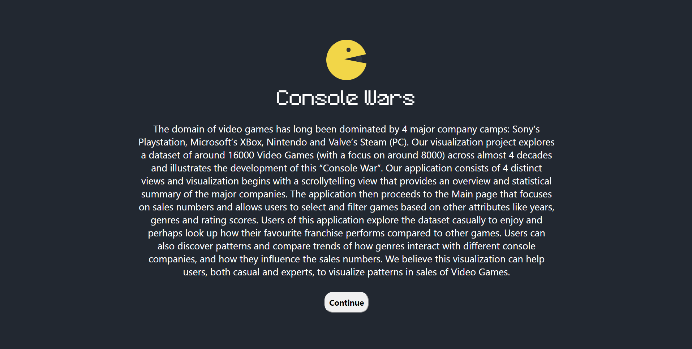
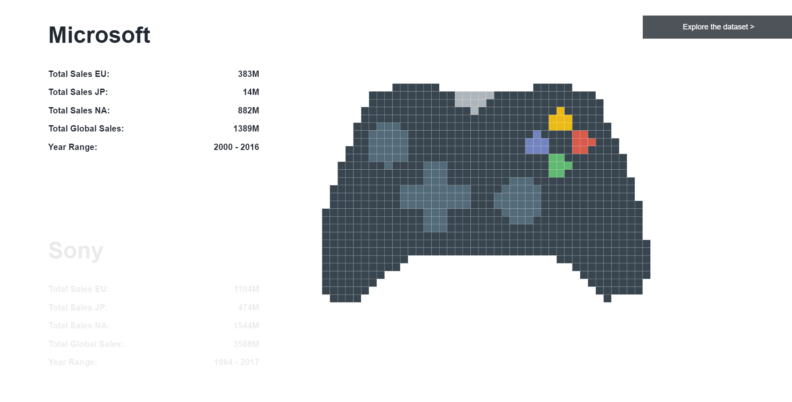
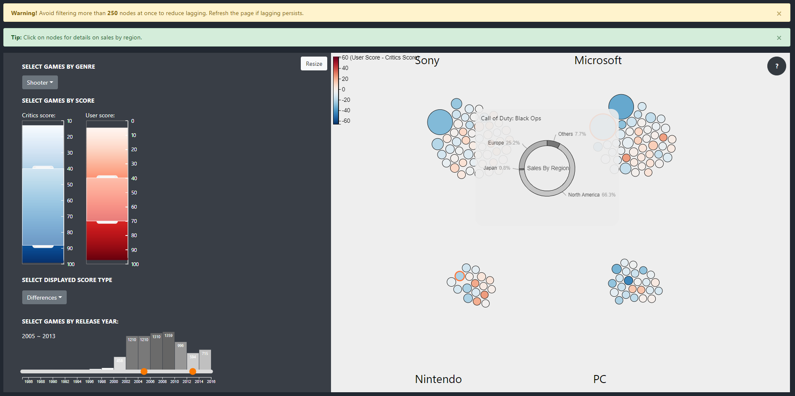
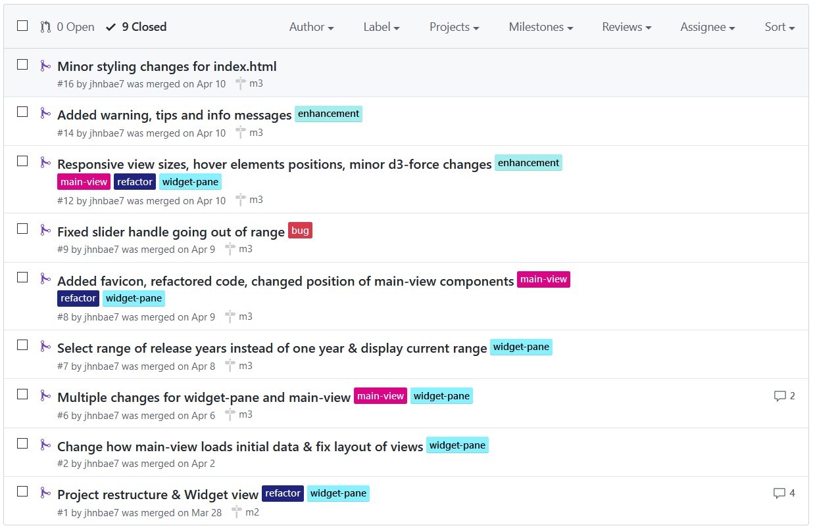
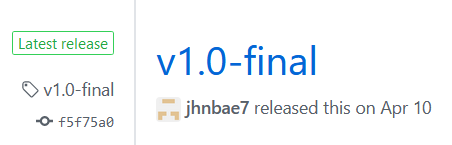

# Console Wars

An interactive visualization term project for Information Visualization course, followed by in-person demo. It is a stand-alone local web application built with JavaScript & D3.js, using a public dataset. Main focus is on front-end development.

For further details about the project, please refer to [Milestone 3](doc/m3-console_wars_v1.0-final.pdf), a comprehensive write-up (which was for marks :wink:) that includes the what, why, and how.

## Getting started

### Prerequisites

-   [npm](https://www.npmjs.com/get-npm) (comes with [Node.js](https://nodejs.org/en/))
-   [http-server](https://www.npmjs.com/package/http-server) v0.12.3 (requirement for team project submission; for further individual development, look into [browser-sync](https://www.browsersync.io/) as alternative)
-   Google Chrome: tested with v81

### Setup

1. Serve the project directory with a local static server.

```bash
http-server . -p 8000
```

2. Access the application entry point `index.html`

```bash
http://localhost:8000/index.html
```

3. For development: disable caching in Developer Tools to view changes made to code without having to restart the server: Network -> Disable Cache

## Usage

1. Main entry point
2. Controller scrolling view
3. Interactive filter widgets and data clusters

## Built with

### Main

-   JavaScript, HTML and CSS

### External library

-   [D3.js](https://www.npmjs.com/package/d3) (mandatory dependency)
-   [Bootstrap](https://www.npmjs.com/package/bootstrap) v4.4.0
-   [Lodash](https://www.npmjs.com/package/lodash) v4.17.15

## Acknowledgements

### Student contributors

-   [Nicole](https://github.com/njbdev)
-   [Megha](https://github.students.cs.ubc.ca/meghas22)
-   [Wesley](https://github.students.cs.ubc.ca/wesleywh)

### Self-reflection (Pride 10/10)

-   Endless nights of pushing commits and opening PRs, accompanied by Americano with the pain shared among my awesome teammates
-   Wrapping up with the final release!
